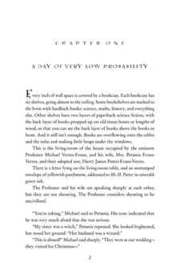

# Harry Potter and the Methods of Rationality: </br> The definitive E-Book/Print/Cover PDF/PNG/LaTeX/PSD version

As per the title, this present a Print and EBook version of the 
very popular fanfic *_Harry Potter and the Methods of Rationality_*,
by Eliezer Yudkowsky.

## TL;DR
(Go [here](#compared-to-other-versions) to see what's different from versions you know)
* Divides the fanfic into six book as recommended by the author plus an additional "Omake"
handbook with extra content such as author's notes and non-cannon chapters.

* Each book has distinct PDFs made for printing (most easily with [Blurb](https://www.blurb.com/pdf_uploader_frontend/index.html#/createBook))
and for reading as EBook. Both are styled after the original Harry Potter books.

* Contains beautiful covers for each book

* LaTeX code for generating the PDFs is available at this repository and 
is thoroughly documented, split and organized.

* PSD files for generating the covers are also available (See Covers directory) and are 
clearly structured based on the different components

* The PDF version for each book can be easily tweaked for the book's name, character, titlepage image and 
included chapters. Farther editing to the way typography is used to communicate meaning (e.g parseltounge,
shouting, newspaper headline, etc.) is also greatly simplified.

* The PSDs for each cover contain alternative designs and titles 
which can be generated easily by toggling layer visibility.

* A submodule _Sources_ is included here in the repository which collects all major 
LaTeX and cover versions published by the fanbase I could find, 
including PDF and PSD source files wherever available. Some of 
these were used in the making of this version and all of these 
are a potential inspiration for a future custom version by you

## Features in  Detail

### Division into six books + Omake, in a book-like PDF
* Divided into six books as recommended by Eliezer
* Formatted in the style of cannon Harry Potter Books





* Author's notes and epigraphs are completely ommited

* "Final Exam" section is edited and slightly rewritten 
to fit better a full book format (as opposed to a chapter 
post)

* An additional "Omake Files" book is added where each file is
its own chapter, plus the original Final Exam text and the chapter
epigraphs. The titles and headers use "File" instead of "Chapter".

* Generates for each book an appendix with a conversion table 
between the book chapter numbers and their original posting numbers,
so one can easily search and refer to them online.

* Includes the synopsis/teaser for book 1 ([originally posted as an author's 
note on chapter 22](https://www.hpmor.com/chapter/22)) as its first page

* Includes a portion of the first author's notes as a preface on book 1, 
omitting parts that are less relevant to an offline reader who reads the
story as its own text (specifically, including only the paragraphs about the 
story's mysteries, the endorsement of views and truth of science and the 
first copyright disclaimer)

* Includes title pages for the series and the book, the book title page 
including the artwork from the covers.

* Includes a Thanks page at the end which details the full list of people
whose work was used in the final product, as well as links to the relevant
posts/repositories


### Beautiful covers

* Contains covers for each of the books, based on the [covers by u/Forechin99](https://www.reddit.com/r/HPMOR/comments/hvlhkm/trying_to_make_my_own_book_covers_am_i_winning/)
  that merge [Ian Storm Tailor's beautiful color scheme and polyhedron numbering](https://github.com/ianstormtaylor/hpmor),
  [Lily Yao Lu's back cover idea](https://github.com/knuesel/hpmor#covers)
  and [u/phaedrus2000's front cover artwork and style](https://www.reddit.com/r/HPMOR/comments/70sug6/yet_another_set_of_printed_books/dn6e1ew/).

* Quotes are picked to represent the themes of rational thinking 
and humanism, while still being comprehensible outside the context 
of the books.

* Book 1 uses the sorting hat for its artwork instead of the 
usual hand-snapping, so it's more focused on the volume itself

* Also included are the PSD files used to create these covers, 
also containing some 


### Versions for easy print and pretty E-book

* There are distinct E-book and print versions
  * The E-book version:
    * Contains front and back covers in the first and last pages, 
    * Allows some text to slip beyond margins, when using more 
    than one line breaks text flow
    * Colors hyperlinks on thanks page.
  * The print version:
    * Keeps strict margins to make sure everything is in printable area
    * Distinguishes between [inside and outside margin](https://sterlingedblog.files.wordpress.com/2015/12/page-margins.png?w=559)
      such the space between the pages where they are bound is roughly equal to
      the outside margins (with extra space for readability). 
    * Does not color the hyperlinks on the thanks page.
* The LaTeX code chooses which version to generate by simply 
  reading command-line arguments:
  ```bash
  lualatex Volumes/hpmor-1.tex ebook # Generates ebook PDF for book 1
  lualatex Volumes/hpmor-1.tex print # Generates print PDF for book 1
  ```

### Proofread and Copy-edited
  * American English (no britpicks)
  * Many typos fixed
  * Phrasing is sometimes edited to make more sense
  * Some small misquotes fixed
  * Careful kerning & line-breaking to improve text flow
  * Standardized date/time formats
  * Consistent capitalization of various words
  * Standardized and improved the way typography is used
  to communicate meaning (e.g headline, parseltounge, shouting, etc.)
  * Consistent usage of italics for emphasis and bold for extra emphasis (removing usages of caps lock for both)
  * Reduced some redundant usage of caps lock in general
  * Italicized quotation marks of fully italicized quotations

### Made to be customized
  * The LaTeX code which generated the PDF is available at this repository
  and is thoroughly documented and organized. 

  * Each book is generated based on a book template and a number of parameters
  that can be easily set by the user  

  * The PSDs which were used to generate the covers are also available, 
  and include many alternative designs in hidden layers (maintaining the 
  same overall style), which are showcased in the wiki.

  * Each directory has its own README file detailing its purpose, 
  so one can easily understand the structure if they wish to fork the repo.

  * The GitHub wiki contains detailed articles as to how to customize 
  both the content and the covers
  
### A grand _Sources_ submodule
  * Includes 

## Compared to Other Versions

## See Also


## TODO

- Wiki pages: 
  - Tweaking Contents
  - Tweaking Covers
  - Alternative Cover Designs
  - Developing LaTeX (Code Structure)
  - Developing PSD (What features were used)
  - Blurb Printing
  - Note about caps lock formatting
- Dir READMEs
  - Chapters
  - Covers
  - Docs
  - EBooks
  - Extras
  - Fonts
  - Footer
  - Header
  - Omake
  - Preamble
  - Print
  - Volumes
- README file -- sources section
- Sources
  - Add my own repo as submdule
  - Add README
  - Add Repo READMEs
    - ForeChin99
    - IlCensore
    - dewwwey
    - knuesel
    - rdesteney
- Preamble Documentation
- Remove hp prefix from all the files
- Consistent quotations inside macros in general
- Refactor uses of \emph that don't communicate inflection into 
appropriate macros